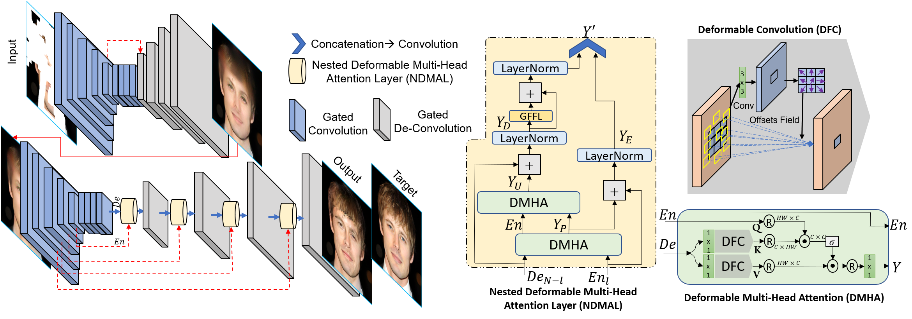

# Nested Deformable Multi-head Attention for Facial Image Inpainting [WACV-23]

PyTorch implementation of [Nested Deformable Multi-head Attention for Facial Image Inpainting](https://openaccess.thecvf.com/content/WACV2023/papers/Phutke_Nested_Deformable_Multi-Head_Attention_for_Facial_Image_Inpainting_WACV_2023_paper.pdf).

## Prerequisites

- Python 3.6+
- [PyTorch>1.0](https://pytorch.org/get-started/previous-versions/)
- cv2, numpy, PIL, torchvision

## Usage

Keep your dataset by placing images like:

    dataset
    ├── celeb
    │   ├── input
    │   │   ├── 1.png 
    │   │   ├── 2.png 
    │   │   └── ...
    │   ├── mask
    │   │   ├── 1.png 
    │   │   ├── 2.png 
    │   │   └── ...    
    │   └── target
    │       ├── 1.png
    │       └── ...

## Checkpoints:

Download the checkpoint: 

    The checkpoints are provided for:
        CelebA-HQ dataset
        Keep the checkpoints in "./checkpoints/"

To test the network:
    
    python test.py
        

The results will be stored in:

    ./results

## Citation
If our method is useful for your research, please consider citing:

    @inproceedings{phutke2023nested,
      title={Nested Deformable Multi-head Attention for Facial Image Inpainting},
      author={Phutke, Shruti S and Murala, Subrahmanyam},
      booktitle={Proceedings of the IEEE/CVF Winter Conference on Applications of Computer Vision},  pages={6078--6087},
      year={2023}
    }

